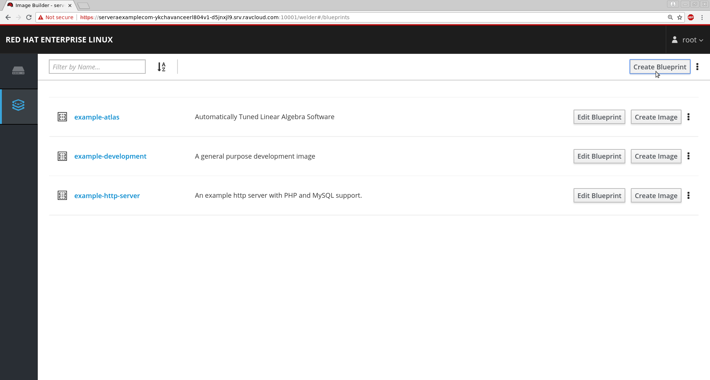
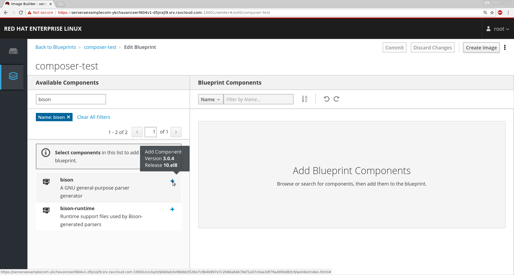
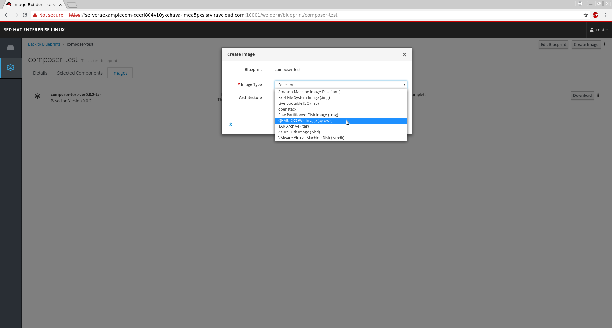

# Create custom RHEL images using Image Builder
## Lab instructions

Presenters:
* Yogesh Chavan
* Nenad Peric
* Karan Rai

Table of Contents:

1. [ LAB Details ](#details)
2. [ Lab 1.1 - Install Image Builder ](#install)
3. [ Lab 1.2 - Create a Blueprint ](#create)
4. [ Lab 1.3 - Add packages to the Blueprint ](#add)
5. [ Lab 1.4 - Create Image ](#createimage)
6. [ Lab 1.5 - Test the output image with virt-install ](#testimage)
7. [ Lab 2.1 - Customize the blueprint configuration file ](#custom)
8. [ Lab 2.2 - Test the new image with virt-install ](#testvirt)
9. [ Resources ](#resource)

# LAB Details

* You have a pre-installed Red Hat Enterprise Linux 8 system
~~~
[lab-user@bastion-LAB-GUID ~]$ hostname
bastion-LAB-GUID.rhpds.opentlc.com
~~~
Here  LAB-GUID  is the number provided to you on the 'Lab information' page

* Following packages are already installed:
  * Web Console (cockpit)
  * virt-viewer
  * virt-install

* Red Hat Web console is enabled. Verify it by running following command
  ~~~
  [root@bastion-LAB-GUID ~]# systemctl is-enabled cockpit.socket
  enabled
  ~~~
# To access the Red Hat Web Console
* Use hostname with port 9090
  ~~~
  https://bastion-LAB-GUID.rhpds.opentlc.com:9090
  ~~~
* You will get a warning that the "connection is not secure". You can accept the self-signed certificate and add an exception.
* Login as lab-user and password to-be-provided
* Check - "Reuse my password for privileged tasks"

  
# Lab 1.1 - Install Image Builder

* Open a SSH session to your RHEL 8 server and run the following commands.
  * You can also use the **terminal** tab on Red Hat web console.
* Use sudo to become root
~~~
[lab-user@bastion-LAB-GUID ~]$ sudo -i
[root@bastion-LAB-GUID ~]#
~~~

* Install *Image Builder* with the CLI and the web console plugin:
~~~
[root@bastion-LAB-GUID ~]# yum install lorax lorax-composer composer-cli cockpit-composer
~~~

* Enable and start composer service
~~~
[root@bastion-LAB-GUID ~]# systemctl enable --now lorax-composer.socket
~~~

* Restart cockpit service to load newly installed plugin
~~~
[root@bastion-LAB-GUID ~]# systemctl restart cockpit.service
~~~

  **Note**: Restarting the web console will log you out, you need to relogin

* Now you should be able to see the "Image Builder" tab on left hand side of the Web Console.

 Click image to view at full size.

# Lab 1.2 - Create a Blueprint

* On the Image Builder tab, click on **Create Blueprint** button on the top right corner.
* Give a name something like - summit2019

 Click image to view at full size.

**Note:** Remember the Blueprint name, you will need it in the later section of this lab.

# Lab 1.3 - Add packages to the Blueprint

* On the *Edit Blueprint* page search the available packages in *Available Components* search box for "bison" package
* Click on the "+" icon to add the packages
* Add more packages if you like
* After adding packages click on **Commit** on the top right corner.

 
 

 Click image to view at full size.

# Lab 1.4 - Create Image

* After adding the packages, click on you blueprint on the top left corner "summit2019"
* Verify the packages that you have added in the "Selected Components" table
* Next click on the **images** tab and click on **Create Image**
* Select the **Image Type** as **QEMU QCOW2 Image**(qcow2)

 
 

 Click image to view at full size.

**Note** Creation of a new Image may take 5 to 10 minutes

* Meanwhile you can monitor logs at /var/log/lorax-composer.  Once completed, you can download image file to your local machine by clicking 'download' button.

# Lab 1.5 - Test the output image with *virt-install*

* On the Lab-GUID Assignment tab in your browser, at the bottom of the page there is a link to the console of your RHEL 8 server. When you click on that link, you will be presented with a SUMMIT-LAB control page. On it under "0bastion" click "CONSOLE". This will open a graphical console of your RHEL 8 server

* Log in as lab-user and the provided password.

* Click on Activities and choose terminal

* Use "sudo -i" to become root.

* We need location of the qcow2 file created to boot from it. To get that, we need to get the image-GUID of newly created image using command
~~~
[root@bastion-LAB-GUID ~]# composer-cli compose list
99ed96cd-b783-4cad-838f-c8173e038431 FINISHED summit2019 0.0.2 qcow2                                                                                                                                 
~~~
In our case, it is 99ed96cd-b783-4cad-838f-c8173e038431. Yours will be different.

* Test the image with virt-install. It will start virt-viewer where you can see your vm booting up
~~~
[root@bastion-LAB-GUID ~]# virt-install --name RHEL8Lab1 --memory 2048 --vcpus 2 --os-variant rhel8.0 --import --disk /var/lib/lorax/composer/results/<image-GUID>/disk.qcow2
~~~

<h3>Congratulations! You built your first image.</h3>

Try to log in as "myuser" with password "mypassword". Try to login as root.
We are done with Lab 1 here. *Wait* for instructor to start Lab 2.

 

<h1>LAB 2 - Customize the RHEL image using composer-cli</h1>

# Lab 2.1 - Customize the blueprint configuration file

* Download a copy of the blueprint configuration file from Image Builder

~~~
[root@bastion-LAB-GUID ~]# composer-cli blueprints save summit2019
~~~
* You will get a file **summit2019.toml**

* Append the following lines to the summit2019.toml file
~~~
[[customizations.user]]
name = "myuser"
password = "mypassword"
groups = ["users", "wheel"]
~~~

* Push the revised blueprint configuration file back to Image Builder
~~~
[root@bastion-LAB-GUID ~]# composer-cli blueprints push summit2019.toml
~~~

* Verify that your changes appear in the configuration file
~~~
[root@bastion-LAB-GUID ~]# composer-cli blueprints show summit2019
~~~

* Like we did in Lab 1.4, we will create a new image:
  * After adding the packages, click on you blueprint on the top left corner "summit2019"
  * Next click on the **images** tab and click on **Create Image**
  * Select the **Image Type** as **QEMU QCOW2 Image**(qcow2)

  

# Lab 2.2 - Test the new image wtih *virt-install*

* Go back to your graphical console of your RHEL 8 server

* Get the image-GUID
~~~
[root@bastion-LAB-GUID ~]# composer-cli compose list
~~~

* Test the new image with virt-install
~~~
[root@bastion-LAB-GUID ~]# virt-install --name RHEL8Lab2 --memory 2048 --vcpus 2 --os-variant rhel8.0 --import --disk /var/lib/lorax/composer/results/<image-GUID>/disk.qcow2
~~~

* Verify the VM

  * Login as myuser and password as mypassword (This should work now)
  * Run **id** command to verify if myuser is a member of *users* and *wheel* group
  * Verify that the package(s) you added in the blueprint earlier are installed in the VM
  ~~~
  [myuser@localhost ~]$ rpm -qa | grep -i <package-name>
  ~~~

<h3> Congratulations! you have fixed the problems by customizing the blueprint configuartion file. You have output image ready that has your selected packages installed. It has your configured user added.</h3>
<h3> Similar way you can create images in other format and customize them. </h3>

# Resources

[Building custom system images with composer - RHEL 7](https://access.redhat.com/documentation/en-us/red_hat_enterprise_linux/7/html/installation_guide/chap-composer-x86)

[Composing a customized RHEL system image - RHEL 8](https://access.redhat.com/documentation/en-us/red_hat_enterprise_linux/8/html/composing_a_customized_rhel_system_image/index)

[Download the Presentation](ImageBuilder-Summit.pdf)
